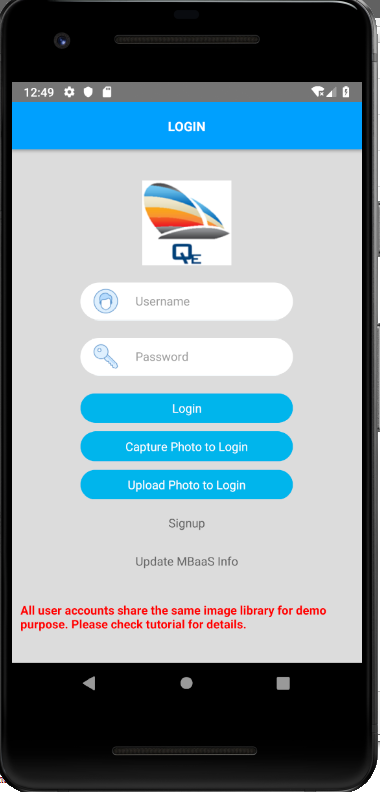
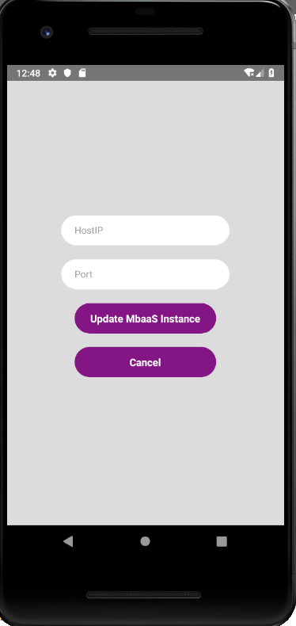

## Step 11:  Update MbaaS Server Information

   MBaaS server instance details can be updated runtime at through the sample app. Please follow the below steps to update the MBaaS server details.

1. Click on "Update MbaaS Info" in app main page.

 

2. Input the valid MbaaS server IP address, port  details and click on "Update MbaaS Instance".

   **Note:** If domain name is used, put the domain name in the HostIP field and omit the port.

 
