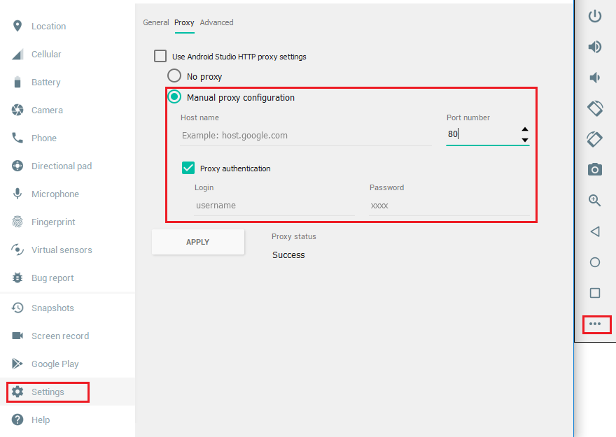

## Step 3:  Setup emulator

We will use an emulator (Android Virtual Device) to run the Mobile Application described in this tutorial.  Follow the instructions below to add an emulator.  

1.	**Important**:  There is port conflict between Windows 10 background process and Android Debugger Bridge (adb).  Both use port 5037.  To avoid this issue, change the ADB port.  At the Windows Start Menu, search **Advance system settings**, then click **Environment Variables** at the bottom-right.  In the User variables section, add a new entry:  

```
   ANDROID_ADB_SERVER_PORT = 6037
```

2.	Restart Android Studio.  Click **Start a new Android Studio project** and accept the default to create a new project.  

3.	From the menu bar, click **Tools -> AVD Manager**.  
  
4.	Click the **Create Virtual Device** button.  

5.	Select **Pixel 2**, then click **Next**.  
  

6.	Select **Oreo, API Level 27, x86**.  If the Download link is enabled, click **Download** to install the image first; otherwise, click **Next**,  
  

7.	Click **Finish**, and new emulator will appear.  
  

8.	Click the start icon under Actions to start the emulator for the first time.  It may takes some time.  
  

9.	Here is how the emulator looks like.    
  

10. (Optional) If proxy is needed, follow the screen shot below to add proxy information to emulator.


11. **Shutdown the emulator for now**.

  
