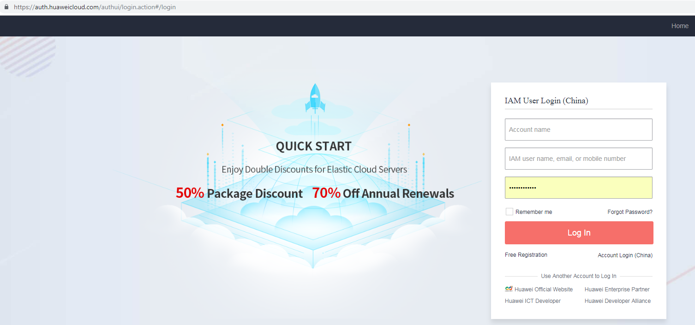
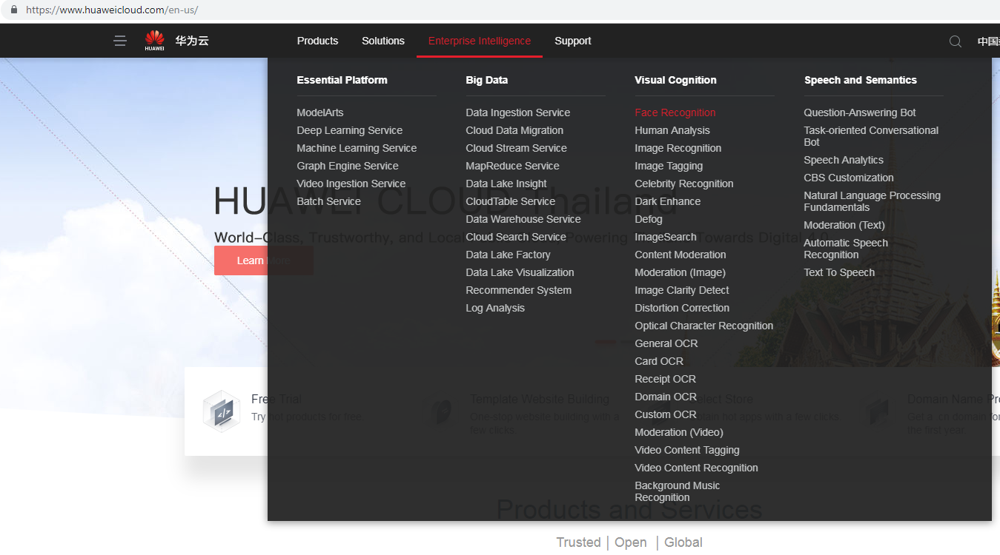
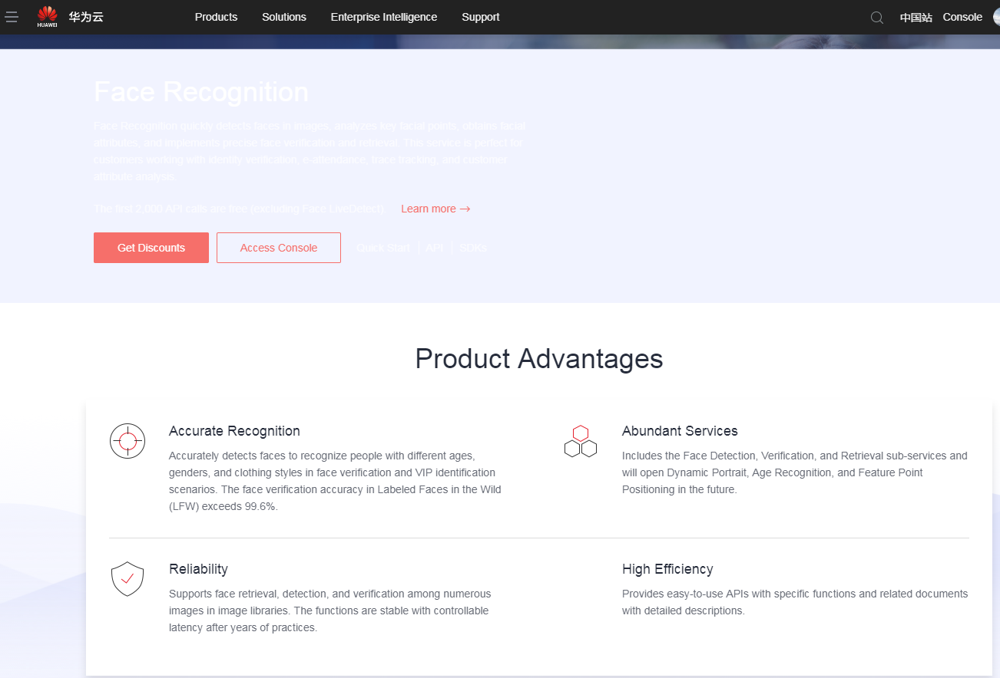
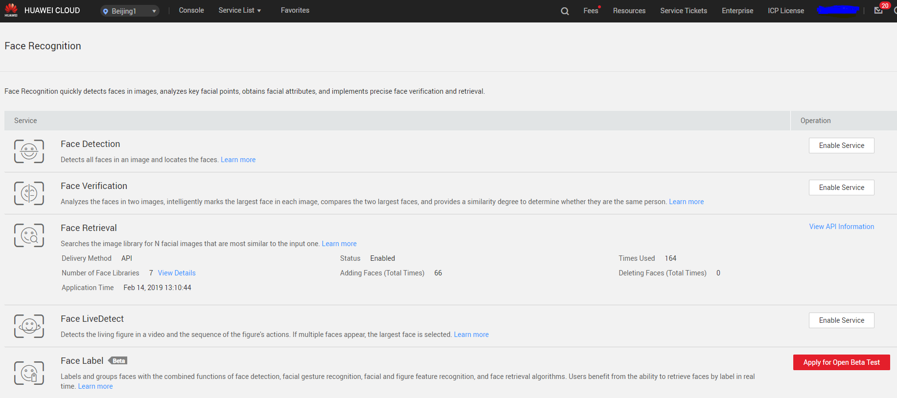

## Step 6:  Enable Face Recognition Service

1.	Login to Huawei cloud.   

2.	Select Face Recognition from Enterprise Intelligence -> Visual Cognition.

3.	Click on Access Console.  

  

4.  Click on Enable Service for Face Retrieval Service.The service will be availabe to use now.

    Refer to https://support.huaweicloud.com/en-us/api-face/face_02_0052.html for more details about face recognition service APIs.