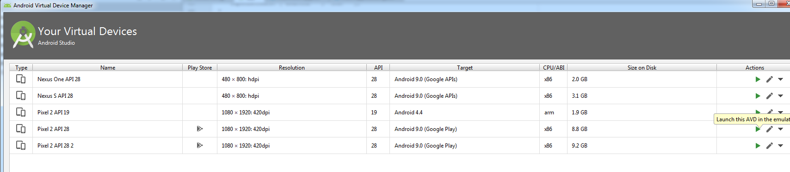
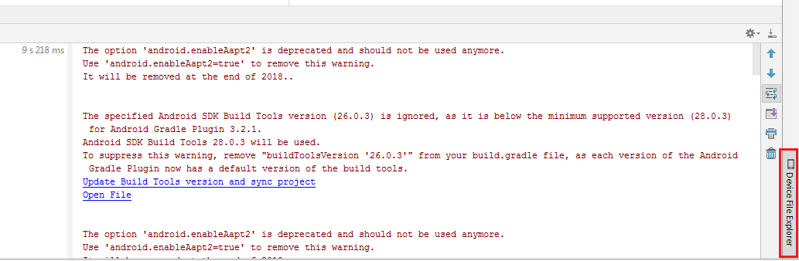
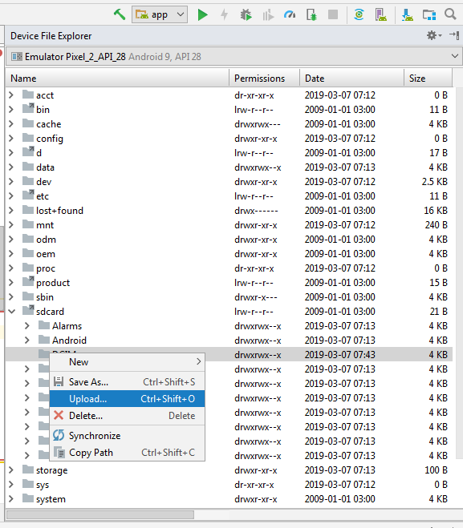
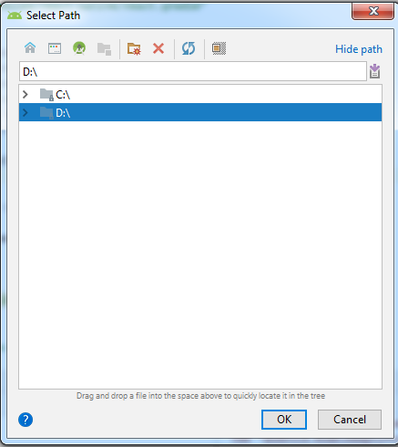

## Step 9:  Upload Pictures to emulator

1. Run emulator from android studio. Tools > AVD Manager

 
 

2. Open  **Device File Explorer** from right side bottom corner of android studio(version 3.2.1). Some android vesions might have **Device File Explorer** option in different place.

3. Go to the path sdcard > DCIM and click to upload. Upload pictures will be there at path: sdcard > DCIM >

